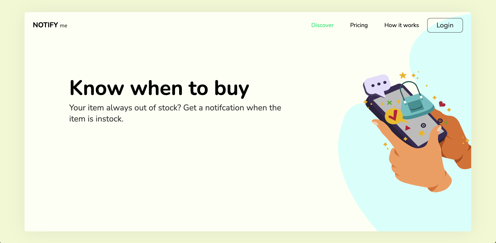
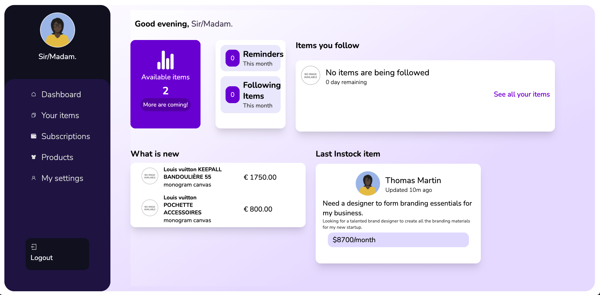

# Notify Me Webapp

## Inhoudsopgave

1. [Introduction](#introduction)
2. [Needed Software](#needed-software)
3. [Installation Manual](#installation-manual)
4. [Custom Backend](#custom-backend)
5. [How to Register](#how-to-register)
6. [Code Formatting & Linting](#code-formatting-and-linting)
7. [Using NVM for Node.js](#using-nvm-for-nodejs)
8. [NPM Scripts](#npm-scripts)
9. [Project Owner](#product-owner)

---

## Introduction

This README describes the web application **Notify Me**.

Ever had that special bag or coat you wanted to buy, but it’s always sold out? With **Notify Me**, you can subscribe to an item and receive notifications when it’s back in stock.

Through this web app, you can track any item, view it's status, and access past data regarding its availability, such as **out of stock** or **in stock** notifications.

**Home Page:**



**Profile Page:**



This project was created using [Create React App](https://github.com/facebook/create-react-app).

---

## Needed Software

Before starting, make sure you have the following software installed:

1. **Node.js** _(version v20.0.0 or higher)_
2. **NPM** _(comes with Node.js)_
3. **Git**
4. **Google Account** _(for authentication purposes)_

---

## Installation Manual

To run the project locally, follow these steps:

1. Open a terminal.
2. Clone the repository:

   \`\`\`bash
   git clone <repository-url>
   \`\`\`

3. Navigate into the project folder and install dependencies:

   \`\`\`bash
   npm install
   \`\`\`

4. Start the application:

   \`\`\`bash
   npm start
   \`\`\`

Once the application is running, open [http://localhost:3000](http://localhost:3000) in your web browser.

---

## Custom Backend

This project uses a custom backend built with **Django Rest Framework**, hosted on **Heroku**.

For API documentation, refer to the following endpoints:

- [Swagger Documentation](https://notifyme-be-staging.herokuapp.com/swagger/)
- [ReDoc Documentation](https://notifyme-be-staging.herokuapp.com/redoc/)

> **Note:** When using activation email URLs, please change the protocol from `https` to `http` in the browser.

---

## How to Register

1. Click the **Login** button on the website.
2. Select the **Register** link.
3. Fill out the registration form.
4. After submitting, check your email for the activation link.
5. Copy the URL from the activation email, paste it into your browser, and change the protocol from `https` to `http`.

---

## Code Formatting & Linting

This project uses **Husky**, **Prettier**, and **ESLint** to enforce code quality and consistent formatting.

### Husky Pre-commit Hook

Husky is used to run **ESLint** and **Prettier** checks before each commit. If any files don't meet the linting or formatting requirements, the commit will be blocked until the issues are fixed.

To configure Husky, Prettier, and ESLint:

1. **Husky**: Pre-commit hooks are set up in the `.husky/pre-commit` file, which runs `lint-staged` to automatically format and lint staged files.
2. **ESLint**: Enforces coding standards and catches syntax errors.
3. **Prettier**: Formats the code consistently based on rules defined in the `.prettierrc` file.

### Commands:

- **Format Code**: Run Prettier to format the entire codebase:

  ```bash
  npm run format
  ```

- **Lint Code**: Check the code for linting errors:

  ```bash
  npm run lint
  ```

Both formatting and linting are automatically triggered before committing code using Husky and `lint-staged`.

---

## Using NVM for Node.js

This project requires **Node.js v20.0.0** or higher. It’s recommended to use **Node Version Manager (NVM)** to manage your Node.js versions efficiently.

### Installing NVM

To install NVM, follow these steps:

1. **Linux & macOS**:

   Open a terminal and run:

   ```bash
   curl -o- https://raw.githubusercontent.com/nvm-sh/nvm/v0.39.1/install.sh | bash
   ```

   After installation, add the following to your `.bashrc` or `.zshrc` file:

   ```bash
   export NVM_DIR="$([ -z "${XDG_CONFIG_HOME-}" ] && printf %s "${HOME}/.nvm" || printf %s "${XDG_CONFIG_HOME}/nvm")"
   [ -s "$NVM_DIR/nvm.sh" ] && \. "$NVM_DIR/nvm.sh"
   ```

   Then, restart your terminal or run:

   ```bash
   source ~/.bashrc
   ```

2. **Windows**:

   Download and install NVM for Windows from the official [NVM Windows repository](https://github.com/coreybutler/nvm-windows/releases).

### Using NVM

Once NVM is installed, you can install and use Node.js v20.0.0:

1. Install Node.js v20:

   ```bash
   nvm install 20
   ```

2. Use Node.js v20:

   ```bash
   nvm use 20
   ```

3. Verify that Node.js v20 is being used:

   ```bash
   node -v
   ```

This ensures your project is using the correct version of Node.js as required.

---

## NPM Scripts

Here are the key NPM scripts available for this project:

- **\`npm start\`**: Runs the project in development mode. Open [http://localhost:3000](http://localhost:3000) to view it in the browser.
- **\`npm run build\`**: Builds the app for production. Creates optimized JavaScript, HTML, and CSS files ready for deployment.

---

## Project Owner

This project was created and is maintained by **Levi Bravenboer**.

- [GitHub Profile](https://github.com/levi-bravenboer)

---

### Notes

For any questions or issues regarding the project, feel free to contact the project maintainers or check the documentation linked above.
